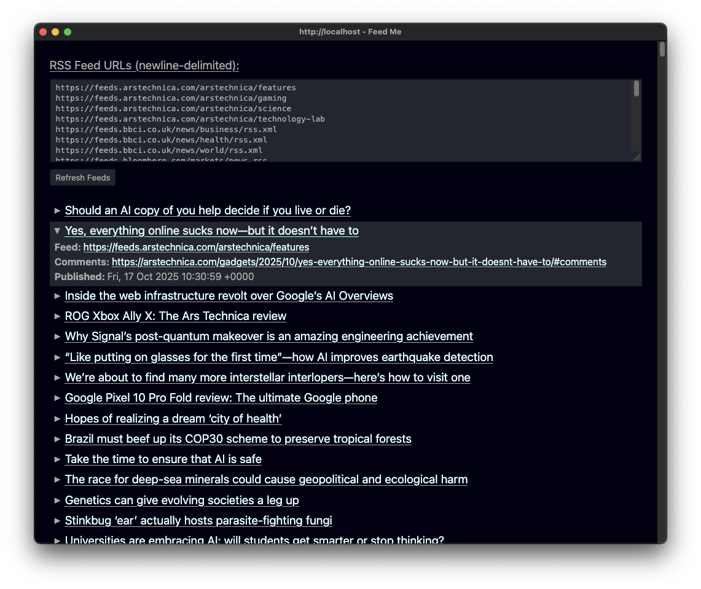

# [Silk][silk] Demo: Feed Aggregator

An [RSS][rss] feed aggregator. It looks like this:



To run this demo locally:

```sh
https://github.com/mkantor/silk-demos.git
cd silk-demos/feed-aggregator
npm ci
PORT=9999 npm run start
```

Then open <http://localhost:9999>.

[rss]: https://en.wikipedia.org/wiki/RSS
[silk]: https://github.com/mkantor/silk
